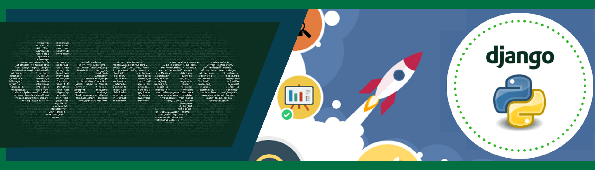
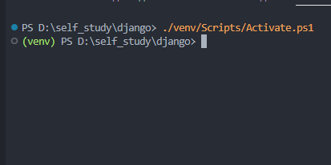
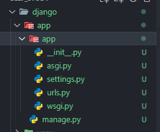
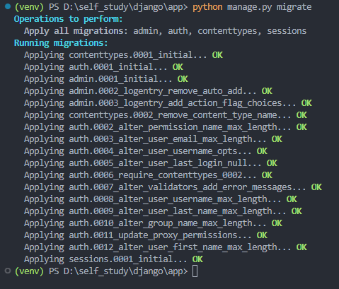
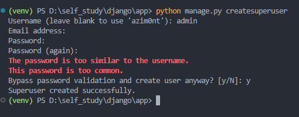
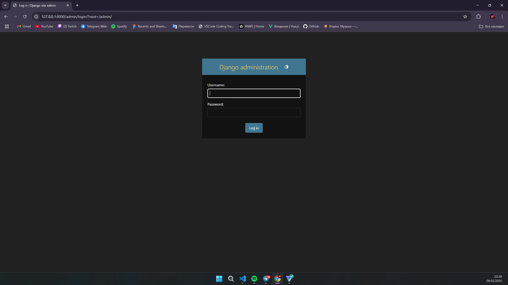
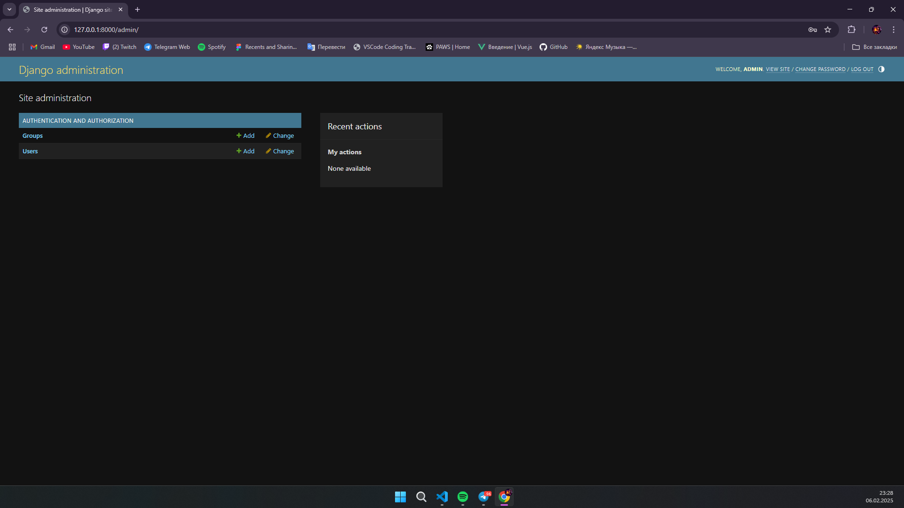

# Django документация

## Django - это python фреймворк, для создания бэкенда. В Django легко стартовать потому что тут всё что нужно создаётся в два клика, и не надо изобретать велосипед

## Начало - Установка Django

> Чтоб установить Django вам необходимо развернуть вертуальное пространство python (это делается командой **"python -m venv venv"**)
>
> ```bash
> python -m venv venv
> ```
>
> Дальше у вас появиться папка venv, теперь вам необходимо активировать вертуальное пространство на разных OS это делается по разному:\
> **Windows** - если вы используете powershell "**./venv/Scripts/Activate.ps1**", если простую командную строку "**venv/Scripts/activate**". \
>
> **Powershell**
>
> ```bash
> ./venv/Scripts/Activate.ps1
> ```
>
> **CMD**
>
> ```bash
> venv/Scripts/activate
> ```
>
> **Mac/Linux** - "**source venv/bin/activate**".
>
> ```bash
> source venv/bin/activate
> ```
>
> 
>
> После этого у вас возле текущей директории появиться имя вашего вертульного пространства. > Это значит что у вас активировалось вернуальное пространство.
> Теперь можно приступить к установке Django, делается это командой "**pip install Django**".
>
> ```bash
> pip install Django
> ```
>
> Дальше нужно создать проект Django, это делается командой "**django-admin startproject название_проекта**".
>
> ```bash
> django-admin startproject app
> ```
>
> У вас создаться папка с проектом:
>
> \
> Это был этап установки Django.

## Запуск и настройка

> После установки нужно запустить Django.
>
> ```bash
> cd app
> python manage.py runserver
> ```
>
> Дальше вам нужно сделать миграцию
>
> ```bash
> python manage.py migrate
> ```
>
> \
> Миграция успешно прошла, теперь нам нужно создать суперпользователя (админа), чтоб мы имели доступ к админ-панели Django.
>
> ```bash
> python manage.py createsuperuser
> ```
>
> \
> После того как вы вели команду вас запрашивает ввод данных для создания суперпользователя, первое поле это ваше имя админа, во втором поле вас запрашивает почту (это можно пропустить), в третьем пароль и подверждения пароля
> Теперь вы можете зайти в админ-панель.
>
> 
>
> Перейдя по пути http://127.0.0.1:8000/admin/ нас запрашивает логин пароль, вводим и нас перекидывает в админ панель
>
> 
>
> Дальше нам надо подключить статик файлы (обычно это стили) и html файлы.
> Идём в настройки джанго (settings.py), и пишем следующий код:
>
> ```python
> # Если вы не импортировали os импортируйте
> import os
>
>
> STATIC_URL = 'static/'
> STATICFILES_DIRS = [os.path.join(BASE_DIR, 'static')]
>
> # Дополнительно создайте папку static
> ```
>
> Ещё нужно подключить templates (это папка где хранятся html страницы).
> Находим переменую TEMPLATES и внутри неё есть пустой лист DIRS, добавляем туда следующий код:
>
> ```python
> TEMPLATES = [
>    {
>        'BACKEND': 'django.template.backends.django.DjangoTemplates',
>        'DIRS': [BASE_DIR / 'templates'],
>        'APP_DIRS': True,
>        'OPTIONS': {
>            'context_processors': [
>                'django.template.context_processors.debug',
>                'django.template.context_processors.request',
>                'django.contrib.auth.context_processors.auth',
>                'django.contrib.messages.context_processors.messages',
>            ],
>        },
>    },
> ]
>
> ```
>
> Теперь где бы мы не находились у нас есть доступ к шаблонам.
> Теперь мы можем заменить страницу по умолчанию на свою и дать ей стили.
>
> Создаём базовую страницу, чтоб по сто раз не повторять одно и тоже.
>
> ```html
> <!DOCTYPE html>
> 
> <html lang="en">
>   <head>
>     <meta charset="UTF-8" />
>     <meta name="viewport" content="width=device-width, initial-scale=1.0" />
>        
>   </head>
>   <body>
>      
>   </body>
> </html>
> ```
>
> Теперь можем сделать главную страницу, создаём **home.html** внутри папки **templates**:
>
> ```html
>   
> <title>Home</title>
>  
> <link rel="stylesheet" href="" />
>  
> <div class="home-wrapper">
>   <h1>Home</h1>
>   <h2>{{info}}</h2>
> </div>
> 
> ```
>
> После того как мы это сделали создаём файл **views.py** в папке **app**:
>
> ```python
> from django.shortcuts import render
>
> def home(request):
>
>    return render(request,'home.html', context={'info':'This is test message.'})
> ```
>
> тут мы создаём функцию которая рендерит страницу home.html.
> render это функция Django которая может загружать html файлы, передавать в страницу context (это информация которая мы показываем на странице, это может быть данные с базы данных, или что-то другое), также оно принимает request это данные о пользователя (в request моэет находится информация зашел ли в систему пользователь, является он суперпользователем и тд.)
>
> Теперь импортируем страницу в **urls.py**:
>
> ```python
> from django.contrib import admin
> from django.urls import path
> from .views import home
>
>
> urlpatterns = [
>    path('admin/', admin.site.urls),
>    path('/', home, name='home')
> ]
> ```
>
> Тут мы передаём в **path** три аргумента, это по какому адресу расположен, в нашем случаи на главной странице. Второй аргумент что расположить, это страница **home**. Третье это необязательный но полезни, с помощью его мы можем кратко получить ссылку страницы. 
>
>
> Например:
>
> > Вместо:
> >
> > ```html
> > <a href="http://127.0.0.1:8000/">Home</a>
> > ```
> >
> > Можно написать:
> >
> > ```html
> >  <a href="">Home</a>
> > ```

## Создание простого приложения Django:

> Теперь для примера создадим приложение. Это будет с список работников, и функции их добавление в список
