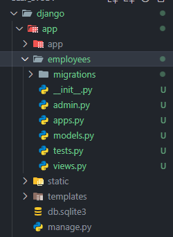
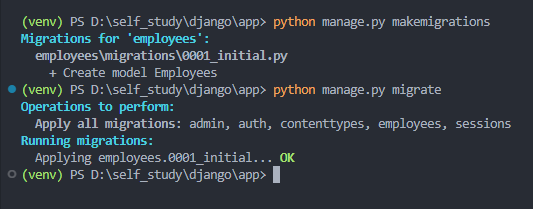
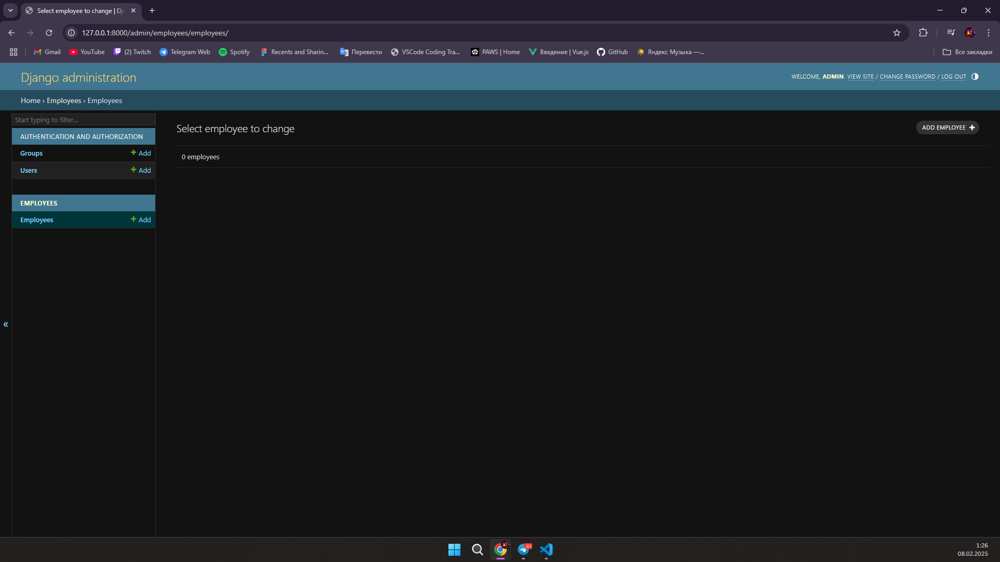
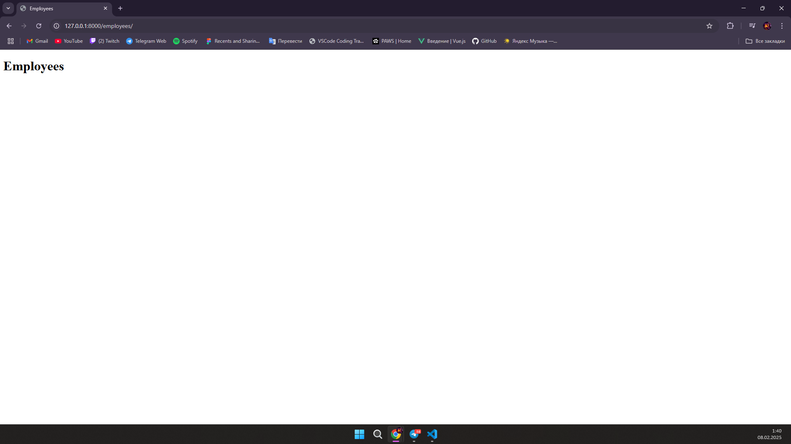
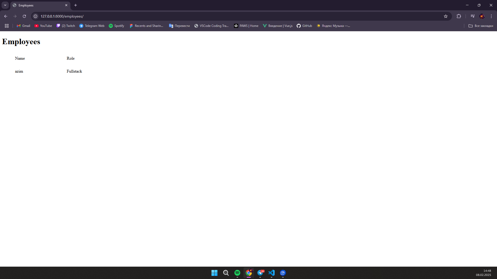
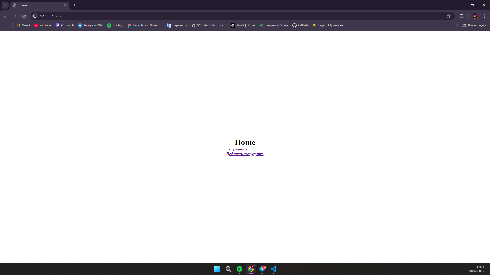
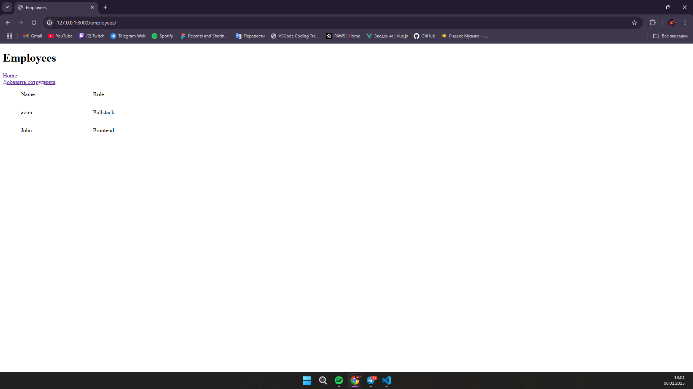
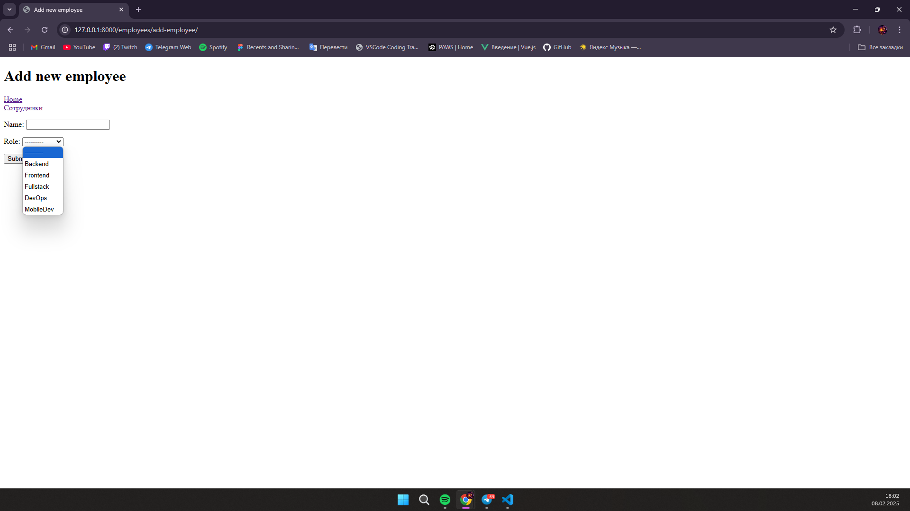

# Django документация

## Django - это python фреймворк, для создания бэкенда. В Django легко стартовать потому что тут всё что нужно создаётся в два клика, и не надо изобретать велосипед

## Начало - Установка Django

> Чтоб установить Django вам необходимо развернуть вертуальное пространство python (это делается командой **"python -m venv venv"**)
>
> ```bash
> python -m venv venv
> ```
>
> Дальше у вас появиться папка venv, теперь вам необходимо активировать вертуальное пространство на разных OS это делается по разному:\
> **Windows** - если вы используете powershell "**./venv/Scripts/Activate.ps1**", если простую командную строку "**venv/Scripts/activate**". \
>
> **Powershell**
>
> ```bash
> ./venv/Scripts/Activate.ps1
> ```
>
> **CMD**
>
> ```bash
> venv/Scripts/activate
> ```
>
> **Mac/Linux** - "**source venv/bin/activate**".
>
> ```bash
> source venv/bin/activate
> ```
>
> 
>
> После этого у вас возле текущей директории появиться имя вашего вертульного пространства. > Это значит что у вас активировалось вернуальное пространство.
> Теперь можно приступить к установке Django, делается это командой "**pip install Django**".
>
> ```bash
> pip install Django
> ```
>
> Дальше нужно создать проект Django, это делается командой "**django-admin startproject название_проекта**".
>
> ```bash
> django-admin startproject app
> ```
>
> У вас создаться папка с проектом:
>
> \
> Это был этап установки Django.

## Запуск и настройка

> После установки нужно запустить Django.
>
> ```bash
> cd app
> python manage.py runserver
> ```
>
> Дальше вам нужно сделать миграцию
>
> ```bash
> python manage.py migrate
> ```
>
> \
> Миграция успешно прошла, теперь нам нужно создать суперпользователя (админа), чтоб мы имели доступ к админ-панели Django.
>
> ```bash
> python manage.py createsuperuser
> ```
>
> \
> После того как вы вели команду вас запрашивает ввод данных для создания суперпользователя, первое поле это ваше имя админа, во втором поле вас запрашивает почту (это можно пропустить), в третьем пароль и подверждения пароля
> Теперь вы можете зайти в админ-панель.
>
> 
>
> Перейдя по пути http://127.0.0.1:8000/admin/ нас запрашивает логин пароль, вводим и нас перекидывает в админ панель
>
> 
>
> Дальше нам надо подключить статик файлы (обычно это стили) и html файлы.
> Идём в настройки джанго (settings.py), и пишем следующий код:
>
> ```python
> # Если вы не импортировали os импортируйте
> import os
>
>
> STATIC_URL = 'static/'
> STATICFILES_DIRS = [os.path.join(BASE_DIR, 'static')]
>
> # Дополнительно создайте папку static
> ```
>
> Ещё нужно подключить templates (это папка где хранятся html страницы).
> Находим переменую TEMPLATES и внутри неё есть пустой лист DIRS, добавляем туда следующий код:
>
> ```python
> TEMPLATES = [
>    {
>        'BACKEND': 'django.template.backends.django.DjangoTemplates',
>        'DIRS': [BASE_DIR / 'templates'],
>        'APP_DIRS': True,
>        'OPTIONS': {
>            'context_processors': [
>                'django.template.context_processors.debug',
>                'django.template.context_processors.request',
>                'django.contrib.auth.context_processors.auth',
>                'django.contrib.messages.context_processors.messages',
>            ],
>        },
>    },
> ]
>
> ```
>
> Теперь где бы мы не находились у нас есть доступ к шаблонам.
> Теперь мы можем заменить страницу по умолчанию на свою и дать ей стили.
>
> Создаём базовую страницу, чтоб по сто раз не повторять одно и тоже.
>
> ```html
> <!DOCTYPE html>
> 
> <html lang="en">
>   <head>
>     <meta charset="UTF-8" />
>     <meta name="viewport" content="width=device-width, initial-scale=1.0" />
>        
>   </head>
>   <body>
>      
>   </body>
> </html>
> ```
>
> Теперь можем сделать главную страницу, создаём **home.html** внутри папки **templates**:
>
> ```html
>   
> <title>Home</title>
>  
> <link rel="stylesheet" href="" />
>  
> <div class="home-wrapper">
>   <h1>Home</h1>
>   <h2>{{info}}</h2>
> </div>
> 
> ```
>
> После того как мы это сделали создаём файл **views.py** в папке **app**:
>
> ```python
> from django.shortcuts import render
>
> def home(request):
>
>    return render(request,'home.html', context={'info':'This is test message.'})
> ```
>
> тут мы создаём функцию которая рендерит страницу home.html.
> render это функция Django которая может загружать html файлы, передавать в страницу context (это информация которая мы показываем на странице, это может быть данные с базы данных, или что-то другое), также оно принимает request это данные о пользователя (в request моэет находится информация зашел ли в систему пользователь, является он суперпользователем и тд.)
>
> Теперь импортируем страницу в **urls.py**:
>
> ```python
> from django.contrib import admin
> from django.urls import path
> from .views import home
>
>
> urlpatterns = [
>    path('admin/', admin.site.urls),
>    path('/', home, name='home')
> ]
> ```
>
> Тут мы передаём в **path** три аргумента, это по какому адресу расположен, в нашем случаи на главной странице. Второй аргумент что расположить, это страница **home**. Третье это необязательный но полезни, с помощью его мы можем кратко получить ссылку страницы. 
>
>
> Например:
>
> > Вместо:
> >
> > ```html
> > <a href="http://127.0.0.1:8000/">Home</a>
> > ```
> >
> > Можно написать:
> >
> > ```html
> >  <a href="">Home</a>
> > ```

## Создание простого приложения Django:

> Теперь для примера создадим приложение. Это будет с список работников, и функции их добавление в список.
>
> Чтоб нам создать приложение нам нужно вести следующюю команду:
> ``` bash
> python manage.py startapp название_приложения
> ```
> После этого у вас в директория появится папка с названием вашего приложения.
>
>
>
> Далее нам необходимо создать модель сотрудника, которая будет содержать такие данные, как имя, роль.
> Заходим в файл **employees/models.py**.
>``` python
>from django.db import models
>
>
>class Employees(models.Model):
>    ROLE_CHOICES = [
>        ('Backend', 'Backend'),
>        ('Frontend', 'Frontend'),
>        ('Fullstack', 'Fullstack'),
>        ('DevOps', 'DevOps'),
>        ('MobileDev', 'MobileDev'),
>    ]
>    
>    name = models.CharField(max_length=50)
>    role = models.CharField(max_length=20, choices=ROLE_CHOICES)
>
>    class Meta:
>        verbose_name = 'employee'
>        verbose_name_plural = 'employees'
>        
>    def __str__(self):
>        return self.name
>```
> Тут мы создаём модель **Employees** которая будет показываться как таблица в базе данных, а в таблице также находятся данные такие как **name** и **role**, **name** указываем как models.CharField (текстовое поле) с максимальной длинной 50 символов, а **role** тоже текстовое поле но с ограничением, то есть мы можете вписать туда информацию только из **ROLE_CHOICES**.
> Класс Meta и функция `__str__` служат для отображение в базе данных. В **Meta** `verbose_name = 'employee'` — задаёт читаемое название модели в единственном числе, а `verbose_name_plural = 'employees'` в множественном.
>
> Дальше нам нужно добавить в настройках наше приложение чтоб Джанго мог его видеть, идём в **settings.py** и ищем лист `INSTALLED_APPS` и добавляем туда название нашего приложения
>``` python
> INSTALLED_APPS = [
>    'django.contrib.admin',
>    'django.contrib.auth',
>    'django.contrib.contenttypes',
>    'django.contrib.sessions',
>    'django.contrib.messages',
>    'django.contrib.staticfiles',
>    'employees'
>]
>```
> Дальше делаем миграцию чтоб Джанго создал в базе данных таблицу с нашей моделью
>``` bash
>python manage.py makemigrations
>python manage.py migrate
>```
>
> Мы добавили в базу данных, но пока что не видно в админ-панели, нужно зайти в **employees/admin.py** и написать:
>``` python
>from django.contrib import admin
>from django.apps import apps
>
>app = apps.get_app_config('employees')
>
>for model_name, model in app.models.items():
>    admin.site.register(model)
>```
>
>
> Всё модель появилась теперь можем добавить туда данные.
> Чтоб показать данные нам нужно создать страницу, создаём папку **templates** внутри **employees**, также создаём **employees.html**.
>``` html
>
>
>
>  <title>Employees</title>
>
>
>
>
>
>
>
>``` 
> Теперь создаю view для страницы:
>``` python
> from django.shortcuts import render
> 
> 
> 
> def employees(request):
>     
>     return render(request,'employees.html')
> 
>```
> И создаём роутинг для станицы, для этого нужно создать файл **urls.py** внутри **employees**:
>``` python
>from django.urls import path
>from .views import employees
>
>urlpatterns = [
>    path('', employees, name='employees')
>]
>
>``` 
>Чтоб наш роут был виден в Джанго, его нужно найти в главном urls.py:
>``` python
>from django.contrib import admin
>from django.urls import path,include
>from .views import home
>
>
>urlpatterns = [
>    path('admin/', admin.site.urls),
>    path('', home, name='home'),
>    path('employees/', include('employees.urls'))
>]
>```
> Тут мы говорим с приложения **employees** найди все пути.
>
>
>
> Всё страница отображается, теперь надо показать данные с модели:
>``` python
>from django.shortcuts import render
>from .models import Employees
>
>
>def employees(request):
>    employees_data = Employees.objects.all()
>
>    return render(request,'employees.html', context={'employees':employees_data})
>```
>Теперь заходим в **employees.html**:
>``` html
>
>
>
>  <title>Employees</title>
>
>
>
><link rel="stylesheet" href=""> 
>
>
>
><div class="employees-wrapper">
>    <h1>Employees</h1>
>    <div class="employees-content">
>        <div>
>            <p class="name">Name</p>
>            <p class="role">Role</p>
>        </div>
>        
>        <div class="employee">
>            <p class="name">{{employee.name}}</p>
>            <p class="role">{{employee.role}}</p>
>        </div>
>        
>    </div>
></div>
>
>``` 
> С помощью цикла достаём всех сотрудников и показываем.
>
>
>
> Теперь добавим возможноть добавлять новых сотрудников, создаём файл **new_employee.html** внутри **employees/templates**. Создаём файл **forms.py** где будет хранится формы приложения.
>``` python
>from django import forms
>from .models import Employees
>
>
>class EmployeesForm(forms.ModelForm):
>    class Meta:
>        model = Employees
>        fields = ['name', 'role']
>```
> Тут мы создаём форму для нашей модель, в метаданных указываем для какой модели создавать форму, и какие поля брать для заполнения. Теперь переходим в **views.py** и создаём страницу для добавления нового сотрудника:
>``` python
>def new_employee(request):
>    if request.method == 'POST':
>        form = EmployeesForm(request.POST)
>        if form.is_valid():
>            employee = form.save(commit=False)
>            employee.save()
>            return redirect('employees')
>    else:
>        form = EmployeesForm()
>    return render(request, 'new_employee.html', context={'form':form})
>```
> Тут мы говорим если в request пост запрос, получаем с него данные сохраняем и отправляем на страницу с сотрудниками, если request не пост запрос, то просто отправляем форму. 
>``` html
> 
> 
> 
> <Title>Add new employee</Title>
> 
> 
> 
> 
> 
> 
> <div class="new-employee-wrapper">
>     <h1>Add new employee</h1>
>     <div class="new-employee-content">
>         <form method="post" enctype="multipart/form-data">
>             
>             {{form.as_p}}
>             <button type="submit">Submit</button>
>         </form>
>     </div>
> </div>
> 
>```
> Тут мы создаём форму с методом пост, внутри формы мы передаём **csfr-токен** чтоб сервер принимал наши пост запросы, вставляем готовую форму от джанго, и кнопка **submit**.
>
> Также не забудьте добавить роутинг для страницы в **urls.py**:
>``` python
> path('/add-employee', new_employee, name='add_employee')
>```
> 
>Принцепи у нас всё готово осталось оставить ссылки на страницы чтоб можно было удобно перемещаться.

>Вот как выглядят все страницы
>> **Home**:
>>
>>
>>
>> **Employees**:
>>
>>
>>
>> **Add new employee**:
>>
>>
>>

